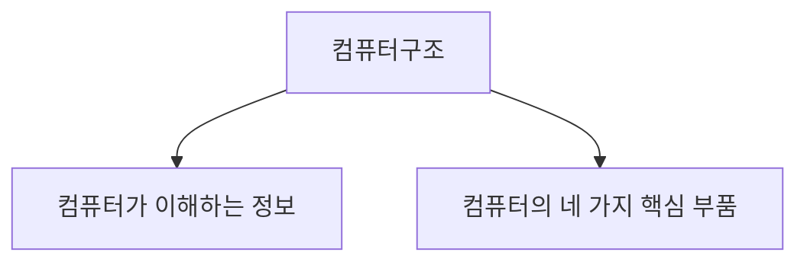
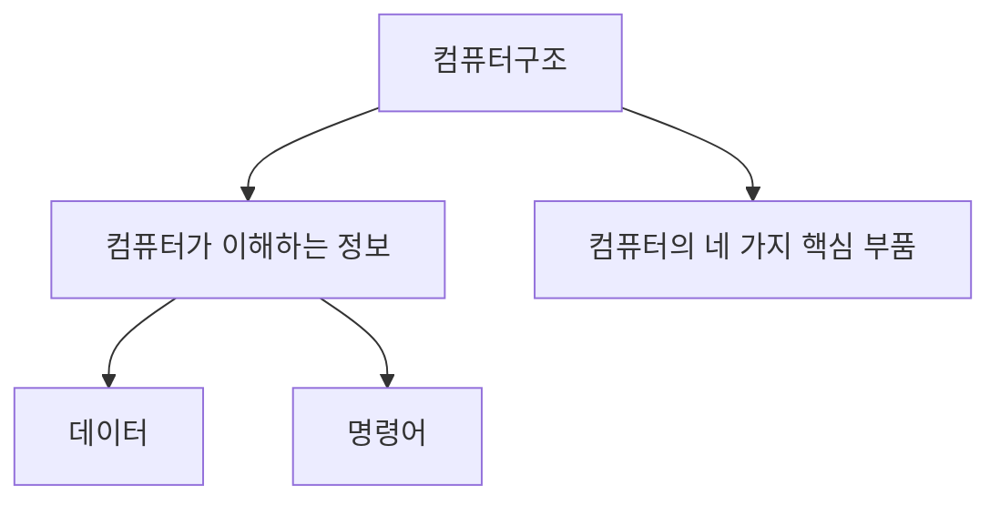
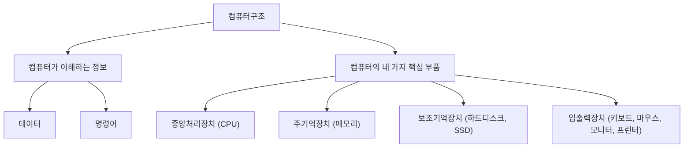

# Chapter1

## 1-1 컴퓨터 구조를 알아야하는 이유

- 컴퓨터 구조를 이해하면, 문제 상황을 빠르게 진단할 수 있고, 문제해결의 실마리를 다양하게 찾을 수 있다.
- 컴퓨터 구조를 이해하면 문법만으로 알기 어려운 성능/용량/비용을 고려하며 개발할 수 있다.

## 컴퓨터 구조의 큰 그림

컴퓨터구조는 크게 두가지로 나눌 수 있다.

### 컴퓨터가 이해하는 정보

컴퓨터는 0과 1로 표현된 정보만을 이해한다.

0과 1로 표현되는 정보에는 크게 두 종류가 있는데, 데이터와 명령어이다.

**_데이터_** : 컴퓨터가 이해하는 숫자, 문자, 이미지, 동영상 같은 **정적**인 정보

**_명령어_** : 데이터를 움직이고 컴퓨터를 작동시키는 정보

EX) '1', '2'는 데이터고, '더하라. 1과 2를'은 명령어이다.

컴퓨터는 명령어를 처리하는 기계이고, 컴퓨터 프로그램은 명령어들의 모음이라고 정의할 수 있다.

### 컴퓨터의 4가지 핵심 부품

컴퓨터는 크게 4가지 핵심 부품으로 구성되어 있다.

**중앙처리장치 (CPU)**

**주기억장치 (메모리)**

**보조기억장치 (하드디스크, SSD)**

**입출력장치 (키보드, 마우스, 모니터, 프린터)**

1. **중앙처리장치 (CPU)**
 - 컴퓨터의 두뇌로, 메모리에 저장된 명령어를 읽어 들이고, 해석하고 실행하는 부품
 - 산술논리연산장치(ALU), 레지스터, 제어장치로 구성되어있다.

**ALU (Arithmetic Logic Unit)**

- 계산기
- 컴퓨터 내부에서 수행되는 대부분의 계산을 수행

**레지스터**

- 작은 임시 저장장치
- 프로그램을 실행하는데 필요한 값들을 임시저장

**제어장치**

- 전기 신호를 내보내고 명령어를 해석하는 장치
- CPU가 메모리에 저장된 값을 읽고 싶을 땐, 메모리를 향해 **메모리 읽기**라는 제어 신호를 보낸다.
- CPU가 메모리에 값을 쓰고 싶을 땐, 메모리를 향해 **메모리 쓰기**라는 제어 신호를 보낸다.

2. **주기억장치 (메모리)**

- 현재 실행되는 프로그램의 명령어와 데이터를 저장하는 부품
- 주소라는 개념을 통해 메모리에 저장된 값에 빠르고 효율적으로 접근한다
- 가격이 비싸 저장용량이 적고, 전원이 꺼지면 값이 휘발된다

3. **보조기억장치**

- 메모리보다 크기가 크고, 전원이 꺼져도 저장된 내용을 유지하는 부품
- 하드디스크, SSD, USB 메모리 등이 있다
- 보조기억장치는 보관할 프로그램을 저장

4. **입출력장치**

- 마이크,스피커,마우스,키보드처럼 컴퓨터 외부에 연결되어 컴퓨터 내부와 정보를 교환하는 장치

5. **메인보드와 시스템버스**

- 지금까지 설명한 핵심 부품들은 모두 메인보드(마더보드)에 연결되어 있다.
- 메인보드에 연결된 부품들은 버스라는 통로로 연결되어 있다.
- 네가지 핵심 부품을 연결하는 버스를 시스템버스라고 한다.

시스템버스는 주소 버스, 데이터 버스, 제어 버스로 구성되어 있다.

**주소 버스** : 주소를 주고받는 통로

**데이터 버스** : 명령어와 데이터를 주고받는 통로

**제어 버스** : 제어 신호를 주고받는 통로